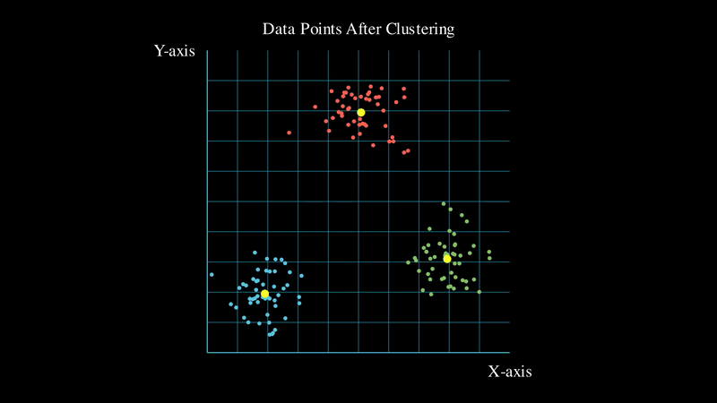

# Manim-Videos

Creating educational videos on core concepts in Computer Science and Data Science using [Manim](https://www.manim.community/). 

 

      

   
(_snippet of one of my lovely videos_)

## Topics covered so far:

* [Principal Component Analysis](https://youtu.be/qRR7MTJ-I3g)
* [Data Clustering](https://youtu.be/CnboqYguOWE)
